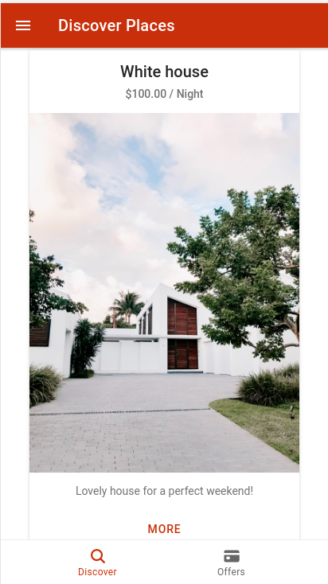
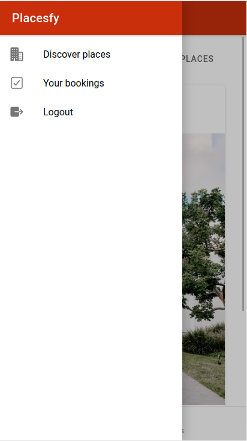
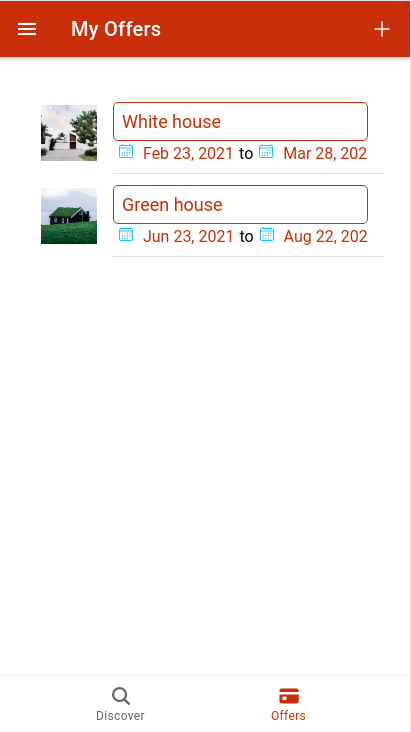
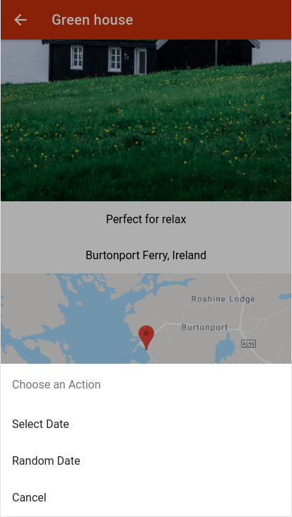
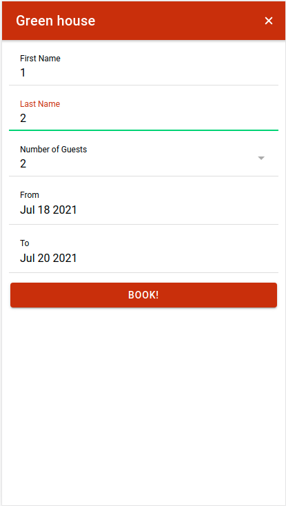

# Placesfy

Placesfy is a Progressive Web App where you offer and book places

The app has been developed during the [Build Native iOS & Android as well as Progressive Web Apps with Angular, Capacitor, and the Ionic Framework (Ionic 4+)](https://www.udemy.com/course/ionic-2-the-practical-guide-to-building-ios-android-apps/) course by **Maximilian Schwarzmüller** in Udemy.

## App description

The app contains the following pages:

- auth
- bookings
  - create-booking
- places
  - discover
    - place-detail
  - offers
    - edit-offer
    - new-offer
    - offer-item

### Auth

This page, along with the Auth service, allows the user to signup and login onto the application. The authentication is performed by using [Firebase Authentication](https://firebase.google.com/docs/auth).

To avoid the user to access to the application before login onto the app [Auth Guard](https://medium.com/@ryanchenkie_40935/angular-authentication-using-route-guards-bf7a4ca13ae3) is used.

### Bookings, create booking

Contains a service, Booking service, that contains the logic needed to add, fetch and delete a booking. It also presents the bookings to the user.

### Places, discover, and place detail.

Includes a similar logic to Bookings (a Place is a house available for booking). The discover page presents the Places to the user, same as in Bookings. Place detail, as you may imagine, shows the details of the Place (name, description, image, address..) and a button for booking it (if you the Place was created by a different user).

### Places, offers, edit offer, new offer, offer item

These pages contain the logic to create an offer and edit an existing one.

## External services

### Google maps

The Google Map integration allows the user to select the address of the place they want to offer using Google Maps.

In addition to this, a preview of the address is generated and stored as part of the offer.

For this, the [Google Maps JavaScript API](https://developers.google.com/maps/documentation/javascript/overview) has been used.

### Firebase

Firebase is used as a backend to store the places available and booked by the user.

It is also used to authenticate the users.

## How to run

In order to run the application you need to create the following files:

### src/environments/environment.ts

There you need to set some API keys and URLs

```
export const environment = {
    googleMapsAPIKey: "",
    firebaseURL: "",
    firebaseImageAPI: "",
    firebaseAPIKey: ""
  };
```

You can get your own API keys and URLs from here:

- [Google Maps API key](https://developers.google.com/maps/documentation/javascript/get-api-key)

* [Firebase URL](https://stackoverflow.com/questions/40168564/where-can-i-find-my-firebase-reference-url-in-firebase-account)

* [Firebase Image API](https://firebase.google.com/docs/functions/get-started)

- This API is the result of deploying the function **storeImage** from functions/index.js

- [Firebase API Key](https://stackoverflow.com/questions/40168564/where-can-i-find-my-firebase-reference-url-in-firebase-account)

### functions/ionic-app.json

This file is the result of generating a private key in the **Firebase project page**, under Project **Settings > Service account > Generate new private key**

## Screenshots











